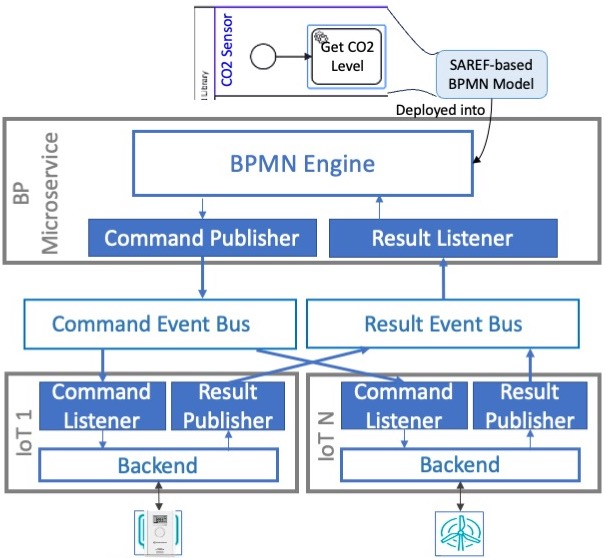

# Supporting Technology Independent Interoperability between Business Processes and IoT Devices

This repository contains the software artefacts developed in the context of a research work leaded by Pedro Valderas at the PROS Research Center, Universitat Politècnica de València, Spain.

# Abstract
The Internet of Things allows digital business processes to use physical devices to automate and improve the execution of some of their tasks. A business process is executed by a process engine, which usually provides built-in mechanisms to interact with IoT devices through REST APIs. However, IoT devices are technologically heterogeneous by nature. If they are not based on REST, the native support provided by process engines is not enough to interact with them. In addition, in case IoT devices have REST APIs, built-in mechanisms of process engines provide technologically coupled solutions since the engine must be configured with the connection data of each specific device. Thus, time-consuming adaptation tasks are required to update the process engine if IoT devices need to be replaced due to changes in business requirements. In this work, we provide a solution to improve these problems based on ontologies, BPMN, and microservices. First, IoT devices are abstractly described by means of the notions proposed by the SAREF ontology. Then, executable BPMN models that use the ontological descriptions of IoT devices are defined to implement a business process. Finally, microservices are used as instantiations of the IoT devices defined with the SAREF ontology, playing the role of gateways between the process engine and the real IoT devices, providing a high level of technological independence between both.

# Supporting architecture
A microservice architecture to support the above-introduced work is described in the following figure:

 

This architecture includes the following microservice:
* BP microservice, which is endowed with a BPMN engine that oversees executing IoT-enhanced BPs such as the one presented in Figure 1. In addition, the communication adapters Command Publisher and Result Listener are also deployed into this microservice. These adapters support event-based communication with IoT microservices (presented below). The tasks they perform to achieve this communication are introduced below in more detail. Note that this is an infrastructure microservice that can be used to deploy several IoT-enhanced BPs independently from their domain.
* An IoT microservice for each IoT device, which supports each SAREF device by implementing a backend that is in charge of managing the interaction with the real device in order to execute operations. This backend is implemented according to the technology used by the device. Two communication adapters are also included in these microservices to support event-based communication with the BP microservice: Command Listener and Result Publisher.

# Respository structure

This repository is made up of 3 folders that contains the following:

* SAREFBPCommandPattern: This folder contains the source code of a Java library that supports the BP microserice in order to implement the Command Pattern. It implementes the communication adapters Command Publisher and Result Listener.
* SAREFIoTMicroservice: This folder contains the source code of a Java library that supports the IoT microservices in order to implement the Command Pattern. It implementes the communication adapters Command Listener and Result Publisher.
* SmartLibraryExample: This folder contains the source code of the implementation of a motivating example: an Smart Library.
